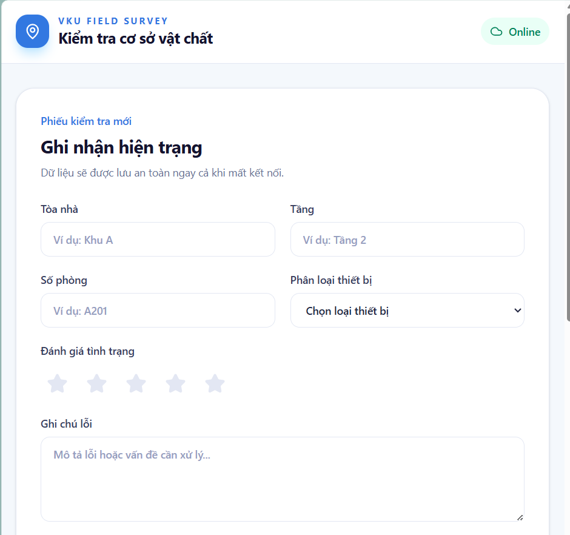
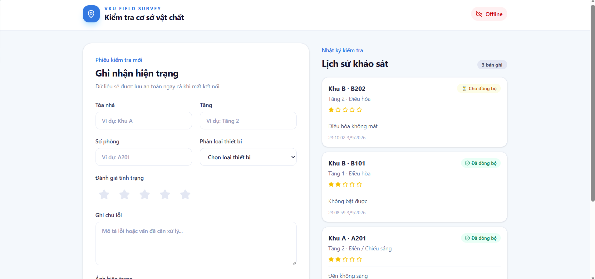
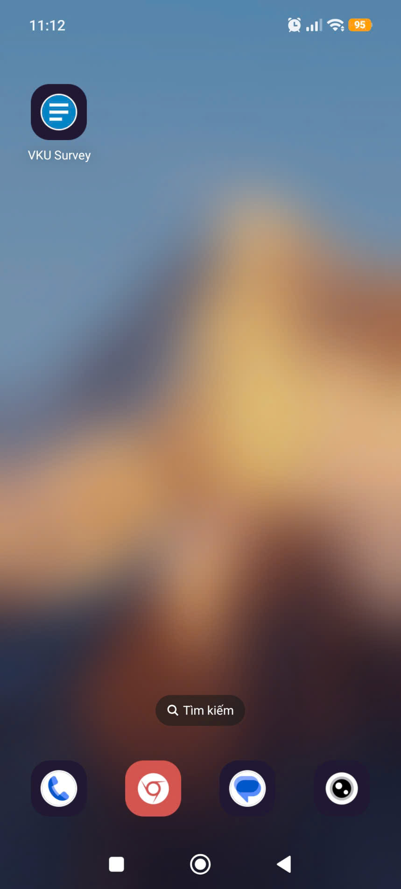

# MINI-PROJECT SHORT TECHNICAL REPORT

**Course:** Cross-Platform Mobile App Development (VKU)  
**Mini-Project Title:** Mini-Project 1: VKU Field Survey — Offline Data Collection (PWA)  
**Team / Student Name:** Dư Thị Như Yến  
**Submission Date:** 03/09/2026

---

## 1. GENERAL INFORMATION & DELIVERABLE LINKS

- **Team Members:**
  1. Dư Thị Như Yến — Student ID: 23IT328 — Role: Full-stack PWA Developer — Contribution: 100%
- **🔗 Live Demo URL:** https://mini-project-1-vku-field-survey-pwa.pages.dev
- **💻 GitHub Repository:** https://github.com/arandomgithubacc/Mini-Project-1_VKU-field-survey-PWA
- **🎥 Video Demo (Optional):** N/A

---

## 2. FEATURE IMPLEMENTATION CHECKLIST

|  #  | Required Feature                      |   Status    | Implementation Details & Acceptance Level                                                                                                                                                                      |
| :-: | ------------------------------------- | :---------: | -------------------------------------------------------------------------------------------------------------------------------------------------------------------------------------------------------------- |
|  1  | PWA Standalone & Responsive Viewport  | ✅ Complete | Giao diện tối ưu di động 100%, hỗ trợ cài đặt standalone PWA, cấu hình Web App Manifest chuẩn (`theme_color: #0284c7`, icons 192x192 & 512x512) và Service Worker Cache-First cho sub-second boot.             |
|  2  | Local Offline Persistence (IndexedDB) | ✅ Complete | Form nhập liệu nhiều trường (Tòa nhà, Tầng, Số phòng, Loại thiết bị, Đánh giá 1-5 sao, Ghi chú, Ảnh). Lưu trữ dữ liệu tức thì vào IndexedDB qua thư viện `localforage`, không mất dữ liệu khi refresh/offline. |
|  3  | Automatic Background Sync Queue       | ✅ Complete | Tất cả dữ liệu offline được gán `UUID` và trạng thái `PENDING_SYNC`. Lắng nghe sự kiện `window.ononline` để tự động đẩy dữ liệu trong hàng đợi lên server và cập nhật trạng thái `SYNCED`.                     |

---

## 3. TECHNICAL ARCHITECTURE & PROJECT STRUCTURE

### Directory Structure

```text
vku-field-survey/
├── public/
│   ├── favicon.ico
│   └── pwa-192x192.png
├── src/
│   ├── assets/
│   ├── services/
│   │   └── db.ts           # Quản lý IndexedDB qua localforage & Sync queue
│   ├── App.tsx             # UI Form kiểm tra, đếm hàng đợi & kiểm tra Online Status
│   ├── index.css           # Tailwind CSS styling
│   └── main.tsx            # Entry point & PWA Register
├── vite.config.ts          # Cấu hình Vite & vite-plugin-pwa (Workbox strategy)
└── package.json
```

### State Management & Sync Flow

1. **Offline Capture:** Người dùng điền phiếu kiểm tra hiện trạng thiết bị -> Ảnh chụp chuyển đổi thành Base64 -> Lưu đối tượng bài khảo sát vào IndexedDB dưới dạng nháp với `syncStatus: 'PENDING_SYNC'`.
2. **Network Detection:** Component chính sử dụng `window.addEventListener('online'/'offline')` để liên tục cập nhật trạng thái kết nối mạng thực tế.
3. **Queue Processing:** Khi thiết bị khôi phục kết nối mạng (Event `online` được kích hoạt), ứng dụng tự động truy vấn danh sách các bản ghi có trạng thái `PENDING_SYNC` từ IndexedDB và gửi tuần tự lên máy chủ. Sau khi gửi thành công, trạng thái bản ghi đổi thành `SYNCED`.

## 4. EMPIRICAL EVIDENCE & SCREENSHOTS

_Hình ảnh thực tế chạy trên trình duyệt di động và giả lập Offline:_

1. **[Screenshot 1: Giao diện Form kiểm tra & Đèn báo Online status]**



_Mô tả:_ Giao diện Form kiểm tra cơ sở vật chất đầy đủ các trường nhập liệu, chụp ảnh hiện trạng và hiển thị đèn trạng thái `🟢 Online` khi có kết nối mạng. 2. **[Screenshot 2: Chế độ Offline & Lưu bài khảo sát vào IndexedDB]**



_Mô tả:_ Ứng dụng hoạt động khi ngắt kết nối mạng (DevTools Network -> Offline), hiển thị badge `🔴 Offline`. Khi bấm nút "Lưu Báo Cáo", bài kiểm tra được đưa vào hàng đợi với thẻ `⏳ Chờ đồng bộ (PENDING_SYNC)`. 3. **[Screenshot 3: Tự động đồng bộ (Auto Sync) khi có mạng trở lại]**

[Đồng bộ dữ liệu](./screenshots/screen3.png)

_Mô tả:_ Khi khôi phục kết nối internet, ứng dụng tự động xử lý danh sách chờ và cập nhật trạng thái bài khảo sát sang `✅ Đã đồng bộ (SYNCED)`. 4. **[Screenshot 4: Tính năng cài đặt PWA Standalone trên di động]**



_Mô tả:_ Menu trình duyệt hiển thị tùy chọn "Cài đặt ứng dụng / Thêm vào màn hình chính" cho phép cài ứng dụng như một App Native độc lập.

## 5. TECHNICAL CHALLENGES & RESOLUTIONS

### Bottleneck 1: Lưu trữ hình ảnh chụp từ camera có dung lượng lớn vào bộ nhớ trình duyệt

- **Thách thức:** Ảnh chụp trực tiếp từ điện thoại thường có dung lượng vài MB, việc chuyển sang chuỗi Base64 dài có thể gây quá tải bộ nhớ và làm chậm thao tác lưu vào IndexedDB.
- **Giải pháp:** Sử dụng Canvas để resize và nén chất lượng ảnh về định dạng JPEG trước khi lưu vào IndexedDB qua `localforage`. Việc này giúp giảm kích thước ảnh xuống dưới 500KB mà vẫn giữ được độ nét của hình ảnh hiện trạng thiết bị.

### Bottleneck 2: Đảm bảo hàng đợi đồng bộ (Sync Queue) không bị gửi trùng lặp dữ liệu

- **Thách thức:** Khi thiết bị mất mạng chập chờn, sự kiện `online` có thể bị kích hoạt nhiều lần liên tiếp, dẫn đến việc trùng lặp các yêu cầu gửi dữ liệu lên server.
- **Giải pháp:** Sử dụng thư viện `uuid` để tạo ID định danh duy nhất cho từng bản ghi ngay tại thời điểm tạo nháp. Khi tiến hành đồng bộ, hàm kiểm tra khóa trạng thái `isSyncing` sẽ được bật để ngăn chặn các tiến trình đồng bộ chạy song song
